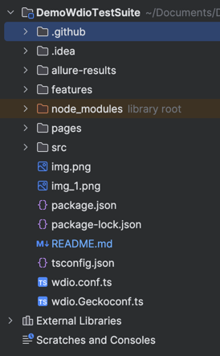

# sauceDemoApp-Tests

This repo is to demo the automation of few features for Sauce Demo App("https://www.saucedemo.com/")
using WebdriverIO + Cucumber framework in Typescript and integrate the repo CI/CD pipeline using GitHub Actions.

## Quick Start

- fork this repository
- go to Actions
- click on the workflow `SauseDemoApp Test Run`
- click on the `Run Worklow` button
- once the workflow execution complete -> goto summary -> artifacts
- download the `allure-results` -> extract the file
- open the `index.html` file to view the report
- by default workflow would run on chrome

## Setup:

This setup is done using 'IntelliJ' IDE
[Node version 21]

1. npm init wdio .
   Installing packages using npm
   configurations selected:

- @wdio/local-runner@latest
- @wdio/cucumber-framework@latest
- @wdio/spec-reporter@latest
- @wdio/allure-reporter@latest
- wdio-wait-for
- @testing-library/webdriverio
- ts-node
- typescript

`default execution command: npm run wdio`

2. add all the configurations required in `wdio.cf.ts`
3. add all dependencies in the `package.json` file
4. run "`npm install`" to update the dependent packages
5. create the folder structure as per the framework
6. 

## Framework in detail

- `features` contains all the feature files
- `pages` contains all the elements xpath segregated along the pages
- `src` contains the steps, support files (actions, checks, libraries)

  ##Additional Information:
  Allure report generating and extracting in local:
  npm install -g allure-commandline
  npx allure generate --single-file --clean allure-results
  OR
  npm allure serve allure-results  (to be in the directory allure results are present)
